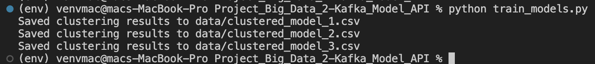
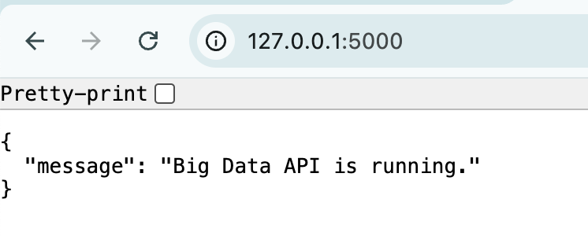
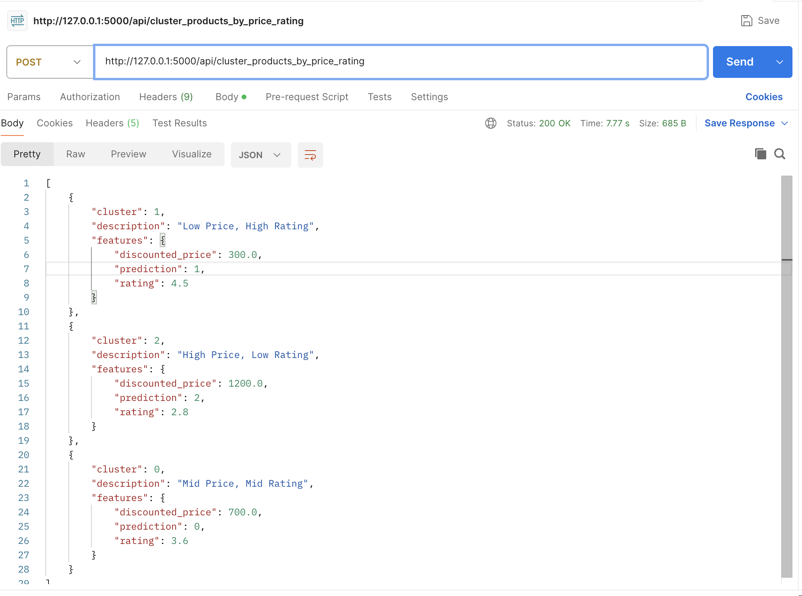
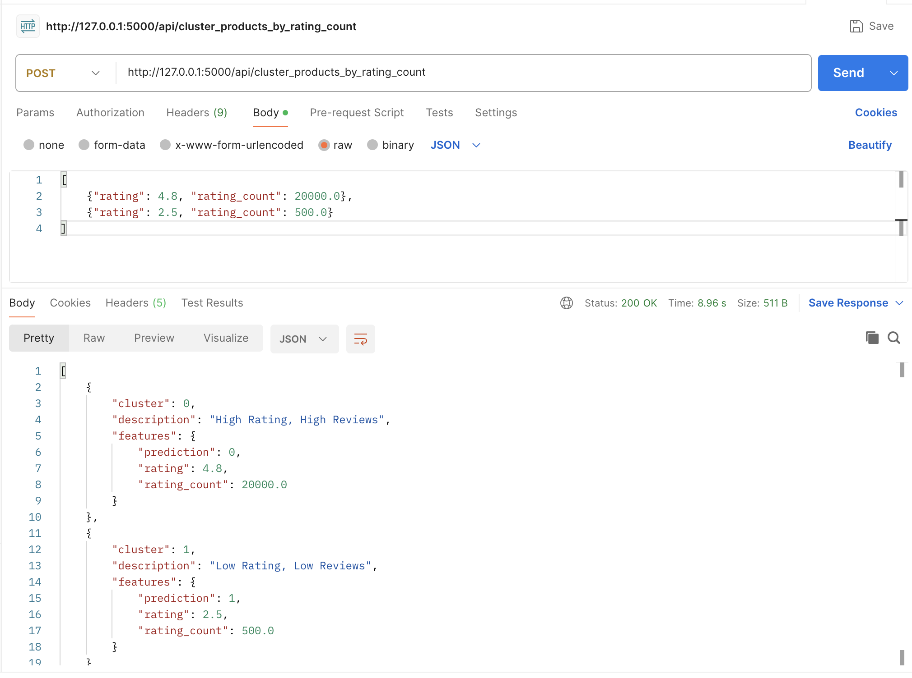
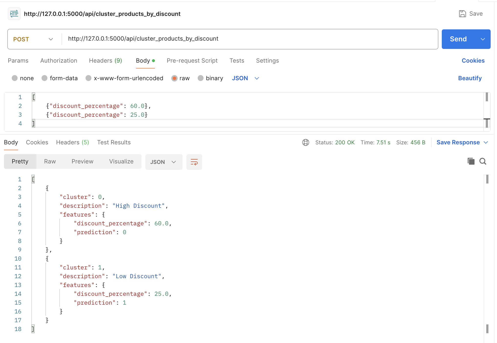

# Project_Big_Data_2-Kafka_Model_API
|         Name            |    NRP     |
|-------------------------|------------|
| Atha Rahma Arianti      | 5027221030 |
| Rafif Dhimaz Ardhana    | 5027221066 |
| Khansa Adia Rahma       | 5027221071 |


Proyek ini menyediakan API untuk sistem streaming data yang dibangun dengan Kafka dan Apache Spark. API ini memungkinkan pengguna untuk melakukan segmentasi produk menggunakan algoritma **KMeans Clustering** berdasarkan atribut seperti harga, rating, jumlah ulasan, dan diskon. Dataset yang digunakan berasal dari Kaggle: ``https://www.kaggle.com/datasets/karkavelrajaj/amazon-sales-dataset``.

## Sistem ini terdiri dari beberapa komponen utama:

1. ```Kafka Producer```: Membaca dataset secara sekuensial dan mengirim setiap baris sebagai aliran data ke server Kafka.

2. ```Kafka Consumer```: Mengambil data dari Kafka, menyimpannya dalam batch berdasarkan jumlah data yang diterima dan waktu pemrosesan.

3. ```Apache Spark```: Melatih model clustering berdasarkan batch data yang masuk menggunakan algoritma KMeans.

4. ```API```: Mengekspos endpoint untuk pengguna meminta hasil clustering atau segmentasi berdasarkan model yang dilatih.

### 1. Memulai Zookeeper dan Kafka
``brew services start zookeeper``
``brew services start kafka``

### 2. Create Kafka topic
```
kafka-topics --create --topic amazon_sales_topic --bootstrap-server localhost:9092 --replication-factor 1 --partitions 1
```
verify
```
kafka-topics --list --bootstrap-server localhost:9092
```

### 3. Create a Virtual Environment
``python -m venv env``
``source env/bin/activate``

### 4. Install the required packages
``pip install -r requirements.txt``

### 5. Menjalankan Kafka Producer
Program ini untuk mengirim data dari dataset ke Kafka. Data dibersihkan dan dikirim dalam bentuk JSON. <br>
``python kafka_producer.py``

### 6. Menjalankan Kafka Consumer
Part ini dijalankan bersamaan dengan producer, untuk membaca data dari Kafka secara realtime, menyimpannya dalam batch, dan menyimpan hasilnya ke file CSV. <br>
``python kafka_consumer.py``


### 7. Melatih Model dengan Spark
Proses ini untuk preprocessing data dan melatih model KMeans berdasarkan batch data yang disimpan.
<br> 

Terdapat 3 model dengan skema sebagai berikut:
- Model 1: 1/3 data pertama
- Model 2: 1/3 data pertama + 1/3 data kedua
- Model 3: 1/3 data pertama + 1/3 data kedua + 1/3 data terakhir (semua data) 
<br>

``python train_models.py``



### 8. Menjalankan API
API akan dijalankan pada server Flask untuk menyediakan endpoint bagi pengguna: <br>
``python api.py`` <br>
**API akan tersedia di** ``http://localhost:5000``

## Endpoint API

### 1. Home

Menampilkan halaman utama untuk memverifikasi bahwa API berjalan dengan baik. **Endpoint**: ``http://127.0.0.1:5000/`` Respon:
```
{
  "message": "Big Data API is running."
}
```


### 2. Cluster Berdasarkan Harga dan Rating

**endpoint**: ``http://localhost:5000/api/cluster_products_by_price_rating`` <br>
**Metode**: POST <br>
**Fitur Input**: ``discounted_price``, ``rating`` <br>
**Deskripsi**:
- Mengelompokkan produk ke dalam cluster berdasarkan harga diskon dan rating.
- Kategori:
    - "Harga Tinggi, Rating Rendah"
    - "Harga Rendah, Rating Tinggi"
    - "Harga Sedang, Rating Sedang"

Contoh Payload:
```
[
    {"discounted_price": 300.0, "rating": 4.5},
    {"discounted_price": 1200.0, "rating": 2.8},
    {"discounted_price": 700.0, "rating": 3.6}
]
```

Respon:



### 3. Cluster Berdasarkan Rating dan Jumlah Ulasan

**endpoint**: ``http://localhost:5000/api/cluster_products_by_rating_count`` <br>
**Metode**: POST <br>
**Fitur Input**: ``rating``, ``rating_count`` <br>
**Deskripsi**:
- Mengelompokkan produk berdasarkan rating dan jumlah ulasan.
- Kategori:<br>
    - "Rating Tinggi, Banyak Ulasan"<br>
    - "Rating Rendah, Sedikit Ulasan" <br>
    - "Rating Sedang, Jumlah Ulasan Sedang"

Contoh Payload:
```
[
    {"rating": 4.8, "rating_count": 20000.0},
    {"rating": 2.5, "rating_count": 500.0}
]
```

Respon:



### 4. Cluster Berdasarkan Diskon

**endpoint**: ``http://localhost:5000/api/cluster_products_by_discount`` <br>
**Metode**: POST <br>
**Fitur Input**: ``discount_percentage`` <br>
**Deskripsi**:
- Mengelompokkan produk berdasarkan persentase diskon.
- Kategori:
    - "Diskon Tinggi"
    - "Diskon Sedang"
    - "Diskon Rendah"

Contoh Payload:
```
[
    {"discount_percentage": 60.0},
    {"discount_percentage": 25.0}
]
```

Respon:


## Cara Kerja Clustering
- **KMeans Clustering**:
    - Algoritma KMeans mengelompokkan data ke dalam tiga cluster menggunakan jarak Euclidean.
    - Data fitur dinormalisasi menggunakan StandardScaler sebelum proses clustering.
- **Deskripsi Cluster**:
Setiap cluster diberi deskripsi yang mudah dipahami berdasarkan centroid yang dihasilkan.
