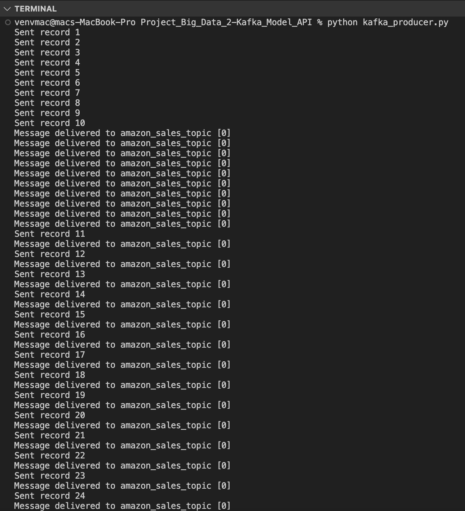
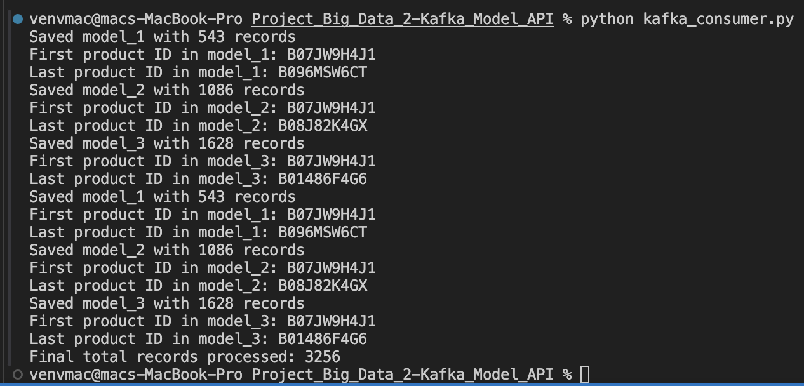
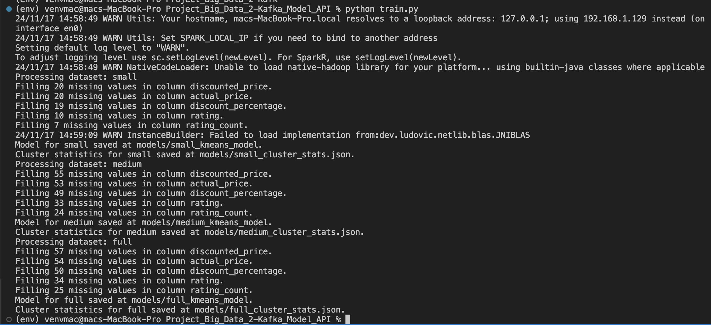

# Project_Big_Data_2-Kafka_Model_API
|         Name            |    NRP     |
|-------------------------|------------|
| Atha Rahma Arianti      | 5027221030 |
| Rafif Dhimaz Ardhana    | 5027221066 |
| Khansa Adia Rahma       | 5027221071 |


Proyek ini menyediakan API untuk sistem streaming data yang dibangun dengan Kafka dan Apache Spark. API ini memungkinkan pengguna untuk mengakses data produk dari dataset Penjualan Amazon yang telah dilatih menggunakan dataset yang diambil dari Kaggle ``https://www.kaggle.com/datasets/karkavelrajaj/amazon-sales-dataset`` dan melakukan berbagai pencarian berdasarkan kategori, nama produk, harga, dan lainnya. 

## Sistem ini terdiri beberapa komponen
1. ```Kafka Producer```: Membaca dataset secara sekuensial dan mengirim setiap baris sebagai aliran data ke server Kafka.

2. ```Kafka Consumer```: Mengambil data dari Kafka, menyimpannya dalam batch berdasarkan jumlah data yang diterima dan waktu pemrosesan.

3. ```Apache Spark```: Melatih beberapa model berdasarkan batch data yang masuk.

4. ```API```: Mengekspos endpoint untuk pengguna meminta prediksi atau hasil clustering berdasarkan model yang dilatih.

### 1. Memulai Zookeeper dan Kafka
``brew services start zookeeper``
``brew services start kafka``

### 2. Create Kafka topic
```
kafka-topics --create --topic amazon_sales_topic --bootstrap-server localhost:9092 --replication-factor 1 --partitions 1
```
verify
```
kafka-topics --list --bootstrap-server localhost:9092
```

### 3. Create a Virtual Environment
``python -m venv env``
``source env/bin/activate``

### 4. Install the required packages
``pip install -r requirements.txt``

### 5. Menjalankan Kafka Producer
Program ini untuk mengirim data dari dataset ke Kafka. Data dibersihkan dan dikirim dalam bentuk JSON. <br>
``python kafka_producer.py``



### 6. Menjalankan Kafka Consumer
Part ini untuk membaca data dari Kafka, menyimpannya dalam batch, dan menyimpan hasilnya ke file CSV. <br>
``python kafka_consumer.py``



### 7. Melatih Model dengan Spark
Proses ini untuk melatih model KMeans berdasarkan batch data yang disimpan. <br>
``python train_models.py``



### 8. Menjalankan API
Merupakan skrip utama yang menjalankan server Flask dan mendefinisikan semua endpoint API. <br>
``python api.py`` <br>
**API akan tersedia di** ``http://localhost:5001``

## Endpoint API

### 1. Home

Menampilkan halaman utama dengan kategori produk.

### 2. Get Products by Category


- **Parameter**: Kategori produk yang ingin dicari.
- **Respon**: Daftar produk dalam kategori yang diminta.

### 3. Get Similar Products


- **Parameter**: Nama produk yang ingin dicari produk serupa.
- **Respon**: Daftar produk serupa.

### 4. Get Products by Price

- **Parameter**:
    - target_price: Harga target untuk pencarian produk.
- **Respon**: Rekomendasi produk dalam rentang harga yang ditentukan.
